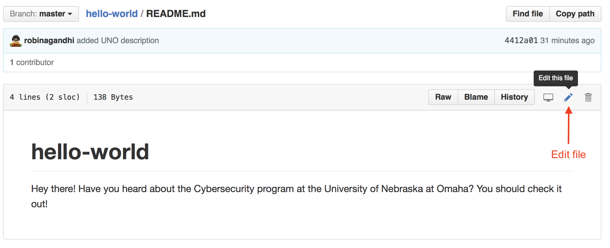
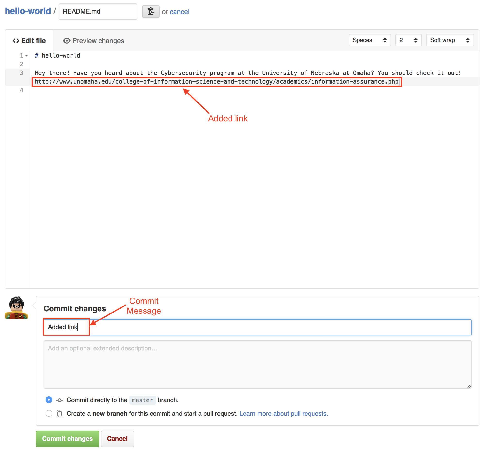
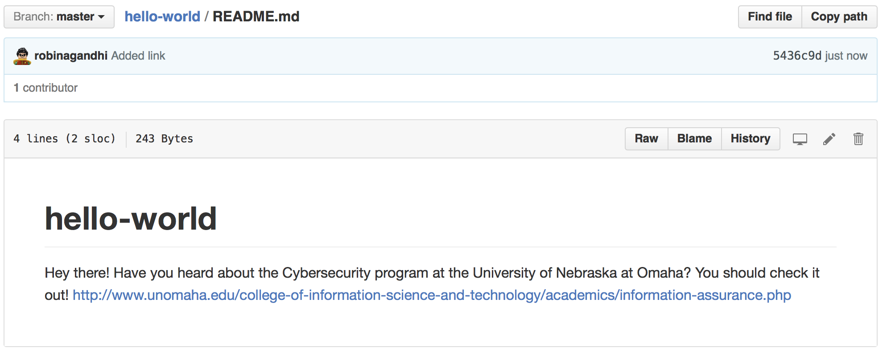
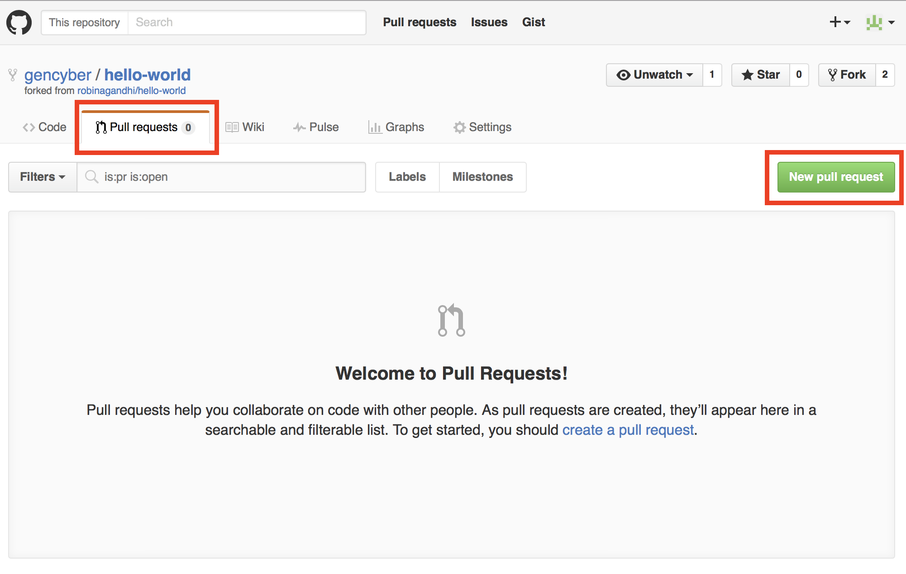
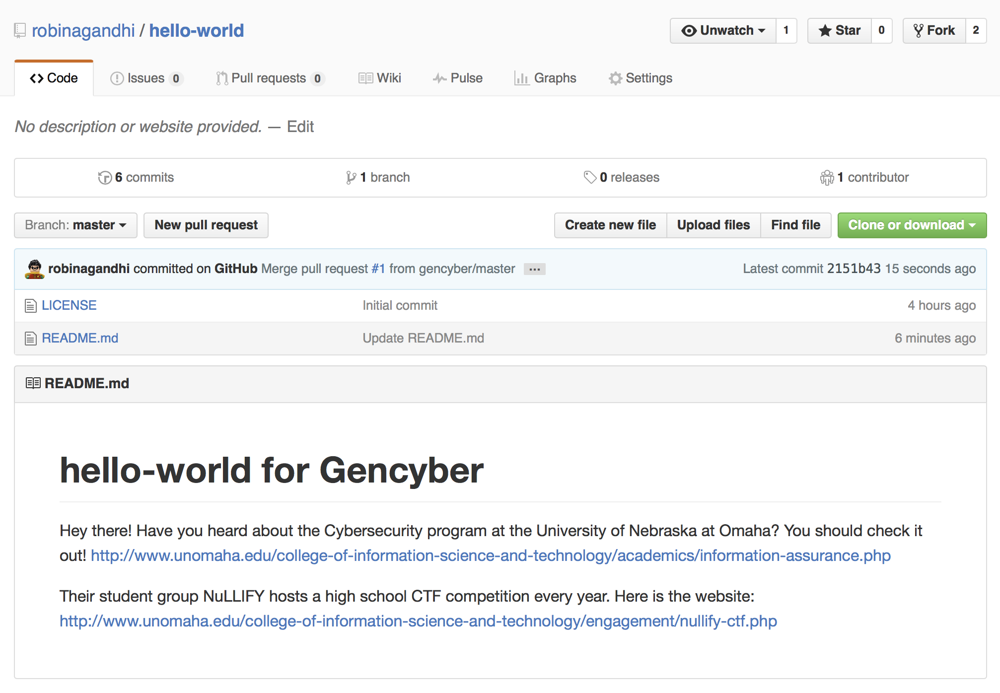

# Github Primer

# Cybersecurity First Principles in this lesson

## Domain Separation
Good fences make good neighbors.  
- It is good to separate source code from build and runtime environments
- Version control for source code prevents accidental or unauthorized changes
- Eliminate dead code

## Modularization
The concept of modularity is like building blocks. Each block (or module) can be put in or taken out from a bigger project. Each module has its own separate function that is interchangeable with other modules.
- Different code repositories can be maintained for project modules

## Least Privilege
One of the ways to protect information is by limiting what people can see and do with your information and resources. The principle of least privilege says to allow the minimum number of privileges necessary to accomplish the task.
- When collaboratively developing code, each collaborator should only have privileges to play their part.   
- For example, a code reviewer should only have the ability to read and comment on code, but not edit it.

# Introduction: Git and Github
* [Git](https://git-scm.com/) is a popular software development tool.
* Used by developers to collaborate and version control code.   
* A collaborative environment to develop written works including code!
* [Github](www.github.com) is popular for online git repository hosting
  - Free for open source  
  - [BitBucket](https://bitbucket.org/), is another such a service.

The following tutorials focus on how you can use Git and Github for collaboration and version control.

# Lesson goals
- Create, clone and manage online repositories
- Create and manage local repositories
- Synchronize repositories
- Collaborate using Github

# Materials required
- [git](https://git-scm.com/download/) (Windows Version)

# Prerequisite lessons
- Lots of curiosity
- [Linux Commands](https://www.cheatography.com/davechild/cheat-sheets/linux-command-line/pdf/). These directory operations will be very useful:
```bash
# Directory Operations
pwd # Show current directory
mkdir dir # Make directory dir
cd dir # Change directory to dir
cd .. # Move up a directory
ls  # list files and directories in current directory
```

# Table of Contents    
<!-- TOC START min:1 max:3 link:true update:true -->
- [Github Primer](#github-primer)
    - [Cybersecurity First Principles in this lesson](#cybersecurity-first-principles-in-this-lesson)
    - [Introduction: Git and Github](#introduction-git-and-github)
    - [Lesson goals](#lesson-goals)
    - [Materials required](#materials-required)
    - [Prerequisite lessons](#prerequisite-lessons)
    - [Table of Contents](#table-of-contents)
    - [Step 1: Create an Account](#step-1-create-an-account)
    - [Step 2: Hello World](#step-2-hello-world)
    - [Step 3: Clone a Repository](#step-3-clone-a-repository)
    - [Step 4: Push Changes](#step-4-push-changes)
    - [Step 5: Pull Remote Changes](#step-5-pull-remote-changes)
    - [Step 6: Fork Repository](#step-6-fork-repository)
    - [Step 7: Make a Pull Request](#step-7-make-a-pull-request)
    - [Step 8: Markdown](#step-8-markdown)
    - [Fork this course](#fork-this-course)
    - [Cyber security First Principle Reflections](#cyber-security-first-principle-reflections)
  - [Additional Resources](#additional-resources)
  - [Acknowledgements](#acknowledgements)
  - [License](#license)

<!-- TOC END -->

# Step 1: Create an Account
First things first, create a free account on Github. https://github.com/join
You will also need to verify your email address after registration in order to use your new GitHub account.

[Top](#table-of-contents)

# Step 2: Hello World
Complete the following Github tutorial:
https://guides.github.com/activities/hello-world/

At the end of Step 2, you will have created a `remote` repository and will have added a `branch`. It is `remote` because all your files are in the Github cloud. As a developer, you might ask, _"how do I use this to create code if it is just online?"_ It is not convenient to write and test code online, especially when many applications require locally install packages to even work. It would be great to use your own `Local` repository. We will do just that in the next step.   

Git is a distributed configuration management system. It helps to `avoid` thinking of a traditional central code repository. Instead, with Git we have multiple independent repositories that could be in different states at any given time and synchronized using specific commits.

[Top](#table-of-contents)

# Step 3: Clone a Repository
To create a `Local` repository there are two basic options.
1. `Clone` a remote repository on your computer, or
2. `Initialize` a new git repository from scratch on your computer.

[Top](#table-of-contents)

## Clone a remote repository
Let's start by looking at option #1 and checking that Git is installed.

- Git tools do not come pre-installed with all operating systems.
- To check if they exist on your operating system, open up a command line interface (`Powershell` for Windows) and type:

  ```bash
  git --version
  ```

- If Git is installed, this command will show the version installed. If the command is not recognized, then it means you need to install git on your OS. The information available at [https://git-scm.com/book/en/v2/Getting-Started-Installing-Git](https://git-scm.com/book/en/v2/Getting-Started-Installing-Git) can walk you through it for a variety of OSes.
- We will assume a Windows OS environment with Powershell as shown below:

> 

To `clone` a remote repository (what we set out to do), we first need a ```reference URL``` to find it.   
* On `Github.com`, navigate to your hello-world repository and click on the button that says ```Clone or download```.   
* Copy that URL.
* Now we are ready to clone this remote repository, and create a local repository.

  ```bash
  git clone <replace this, including angled brackets with the clone URL that you copied above>
  ```

You will start to see some download messages and upon success, your local repository will be ready for use. You may be asked to authenticate with Github credentials if your repository is not public.

>

Now , in Powershell, switch to the hello-world directory that has all the files from the repository that you just cloned.

```bash
cd hello-world/
```

To list the files in this directory, use this command

```bash
ls
```
You should see a README.md and possibly some other files.

## Initialize a new repository

> We do not need to use this option currently, so you may move to [Step 4](#step-4)

If you need to create a new repository you would just navigate to the folder (using the `cd` command) containing the files you wish to version control and then use the init command:
```bash
# Create a new directory
mkdir test
# Switch to that directory
cd test
# Initialize a new git repository
git init
```

That's it! This is useful if you are **creating new files from scratch**. Using GitHub, you can also push newly tracked files such as these to a remote repository. The steps are the same as you will see for cloned repositories below.

[Top](#table-of-contents)

# Step 4: Push Changes
In this step, we will make changes to files in our `Local` repository and then `push` changes back to the `remote` repository.

Git is based on a **de-centralized** model of ownership - which means that there is no central authoritative repository. Every repository, Local or Remote, is fully autonomous and fully functional on its own. So changes made in any repository are tracked in that repository only. Two repositories do not communicate unless there is a explicit request to synchronize changes across them. This will make more sense as we work through a scenario.

Let's open the hello-world folder in windows explorer and make changes to the `README.md` file in a text editor.  

1. Navigate to the files
2. Open README.md in Notepad
3. Edit README.md to add a message. Like the one below.
>

Once you save the edited README.md, check the status of the local repository using the following command. Return to Powershell:

```bash
git status
```
You should see something like this:

>

A few things to notice here about these status messages:  
1. `On branch master`: You are on the master branch in your `local` repository.  
2. `Your branch is up-to-date with 'origin/master'`: Your local repository master branch is in sync with your remote repository master branch on GitHub. The default name for the remote repository is **origin**. This makes sense as you cloned your local repository from it.  
3. `Changes not staged for commit`: git follows a two step process to save changes to a repository.
  1. The user indicates which modified/deleted/new files need to be `staged` for a save in the repository.
  2. The staged files are `committed` to the repository.
4. `modified:  README.md`: git knows that the README.md file has been modified  

Now we `stage` our changes for a commit using this command:
```bash
git add --all
```
The above command `adds` any edited files in a staging area, a temporary holding place before a commit. We can check the status of the repository again using the following command:

```bash
git status
```
You should see something like this:

>

This time the modified files are `staged` for a `commit` and appear in green.

Now before we `commit` these files into our local repository, the git author details need to be set. This is for accountability of commits. Using the commands below, save your information to the git configuration files and set them for all of your local repositories. Make sure to use the same name and email you used to register with Github.

```bash
git config --global user.name "replace this with your name"
git config --global user.email youremail@example.com
```
You should see something like this (with your name and email):
>

Check your configuration changes by using the following command:
```bash
git config --list
```

You only have to set the config parameters once. Now that they are set, git will keep reusing them when making commits or merging your changes with other repositories.

Now let's commit the changes that we staged before. Here we use the `commit` option with `-m` to provide a short commit message. This helps us remember various checkpoints in our editing process. These messages are very helpful to rollback changes to an appropriate commit.

```bash
git commit -m "added UNO description"
```

Use this command to see all your commits:

```bash
git log
```

This command shows a summary of commits in the repository, starting with the most recent. Observe the hash code, user details and commit message. These attributes provide attribution of all changes in the code repository, promoting code integrity.

> Hit the key `q` to exit the log of commit messages.

Issue this command to check your repository status once again:
```bash
git status
```

It should report **no** uncommitted changes. But it indicates that `Your branch is ahead of 'origin/master' by 1 commit`. Which means that our local repository master branch has more recent commits than the remote repository master branch.

To push our local commits to the remote repository (Github in this case), we need the git `push` command. With this command, we need to indicate the name of the remote repository followed by the name of the local repository branch that has updates to be pushed. Do you remember the name of our remote repository and the main branch?

> **Questions**  
> - What is the default name of the remote repository?  
> - What is the name of the main branch a repository?

To `push` local commits in the current branch to a remote repository (`origin` in our case) and its remote branch (`master` in our case), use the following command:

```bash
 git push origin master
```

> To rename a branch in the remote repository, you'd use the same git push command, but you would add one more argument: the name of the new branch. For example:  
> `git push  <REMOTENAME> <LOCALBRANCHNAME>:<REMOTEBRANCHNAME>`  
> This command pushes the LOCALBRANCHNAME to your REMOTENAME, but it is renamed to REMOTEBRANCHNAME.  

Now, issue the `status` command to check your repository status once again:
```bash
git status
```

Visit your remote repository on `Github.com`. Your changes should appear there. You should also see your commit message there. Clicking on the commit message will show the file differences in that commit.

> 

As mentioned before in the introduction, git version control is very efficient for text files. It does not store entire files for old versions but only the differences. So it is prudent to make frequent commits and then push these changes to the remote repository - so that you have as many checkpoints as possible should you need to roll back. To keep the master branch commits clean, it is advisable to do feature development and testing in a feature branch and then merge with master.

[Top](#table-of-contents)

# Step 5: Pull Remote Changes
What happens if we make some changes to README.md on `Github.com`? Or another collaborator makes changes to it. How do we get these changes back into our local repository? We will learn just that in this step.

So, I realized that I forgot to add a link to UNO's Cybersecurity programs in the README.md file. So I will make these changes and commit those changes on Github.com itself.

1. First, click on README.md file on Github and then click the edit option as shown below:
>

2. Make changes, add a commit message and click `Commit changes`
>

3. See changes in your README.md file
>

Now the remote repository is one `commit` ahead of the local repository. To bring the _local_ repository up to speed, we use the following command in a terminal. This single command fetches remote changes (`git fetch`) and merges them (`git merge`) into your local repository.

```bash
git pull
```

> `Sidebar`: If a repository has linked sub-modules (e.g. [nebraska-gencyber](https://github.com/MLHale/nebraska-gencyber)), add the following recursion flags to clone and pull changes from the sub-modules as well:  
> `git clone --recursive https://github.com/MLHale/nebraska-gencyber-dev-env.git`  
> `git pull --recurse-submodules`

Continuing with the lesson, if we look at our local README.MD file in windows explorer, it should have the updated link.
>

At this point, you know enough to keep both the local and remote repositories synchronized.    

As long as you always `pull` before making changes and keep `pushing` any new changes - you will avoid most merge conflicts that can occur.  

If you are interested in learning more about complex team interaction scenarios - you may want to explore a concept called `branching` that avoids most `merge conflicts`; for more information about merge conflicts see: [https://help.github.com/articles/resolving-a-merge-conflict-from-the-command-line/](https://help.github.com/articles/resolving-a-merge-conflict-from-the-command-line/).

[Top](#table-of-contents)

# Step 6: Fork Repository
Now we will learn about **forking** a repository. This is as easy as pie. But what is a fork and what do you use it for?

Here is what Github [says](https://help.github.com/articles/fork-a-repo/):
> A fork is a copy of a repository. Forking a repository allows you to freely experiment with changes without affecting the original project.

> Most commonly, forks are used to either propose changes to someone else's project or to use someone else's project as a starting point for your own idea.

> Every public repository can be forked

So head-on over to a hello-world repository developed by one of your peers. You can do this by browsing to the `git URL` of their hello-world repository in your browser.  

You should see something like this on your peer's repository:
>

Click the `Fork` button.

After forking, you will have your own copy of your peer's repository to work on. Using [Step 3](#step-3) you can `clone` this repository to your local computer. Make changes to files and `push` it back to this forked remote repository.   

Forking a repository is a good way to suggest new features to the original repository that you do not own, using a `pull` request. Let's do this in the next step.

[Top](#table-of-contents)

# Step 7: Make a Pull Request
In this step, make changes to the fork of your peers' repository on `Github.com` and create a `pull request`.

Let's assume that a `gencyber` (insert your ID here) user forks `robinagandhi/hello-world` repository (this will be your peer's repository).

The forked repository for the `gencyber` user will look like this:
>

The `gencyber` user now makes changes to the README.md file in this forked repository. She is also the owner of this new `forked` repository.
>

Now to suggest these changes to the `robinagandhi` user; the `gencyber` user needs to create a `pull request`. So the `gencyber` user switches over to the `Pull Request` tab on the forked repository and clicks the **new pull request** button. It will look something like this:
>

Here is an open pull request that compares the master branches across the two repositories.
>

The `robinagandhi` user is now notified of a `pull request` on his hello-world repository. He examines the suggested changes, and in this case, the files can be automatically merged.
>

In cases where files cannot be merged automatically, discussions around the pull request can help to resolve the conflicts manually. In this case that won't be necessary. With a few more simple clicks the changes are `merged`. Your peer will see something like this to confirm the merge:
>

Here is a confirmation message after a successful `merge`:
>

The updated content is now reflected in the peer's repository. It will be something like this:
>

Now return the favor to your peer. Help them `fork` your hello-world repository and make a `pull request` back to you.

And that is one way you can collaborate using `Github`.

[Top](#table-of-contents)

# Step 8: Markdown
To communicate and write on Github, it is useful to learn `Markdown` and its `Github Flavor Variants`. You may explore this simple format here: https://help.github.com/categories/writing-on-github/


You are now ready to explore the wonderful world of open source on Github. Enjoy and make your own contributions!

[Top](#table-of-contents)

# Fork This Course
We practice what we preach. Our whole course has been developed on GitHub using markdown. Now that you are a git guru, you may as well fork all of the course content, work with it offline and make contributions!

Go to the top of this page and click fork. Boom, you have our whole course, use responsibly 🤓

# Cybersecurity First Principle Reflections

On Github, only the `owner` of a remote repository can push commits to it. All other `Github users` have the limited privilege to make a pull request. The repository owner reviews pull requests and initiates a merge action. The owner may reject pull requests if they do not seem appropriate. A `collaborator` can push commits, but cannot delete a repository or add other collaborators. These constraints show the concept of __least privilege__ with GitHub user roles. Users should have no more privilege than what is required for their job.

Developers often design Github repositories, to be self-contained _modules_. These modules are then put in or taken out of a bigger project. During build time these components are composed to create an integrated system. This strategy facilitates __Modularization__. Following this principle allows globally distributed teams to collaborate and locate faulty components.

Finally, Github repositories separate source code from other resources. This separation allows long term archival and maintenance of a codebase, separate from its dependencies. __Domain Separation__ enables the management of source code versions that target different products and operating environments.

[Top](#table-of-contents)

# Git, err...Get your engines ready!
* [Quiz](https://unomaha.instructure.com/courses/3042/quizzes/9026)

# Additional Resources

* Creating a local repository first and then adding a remote repository, [Github](https://try.github.io/)
* [Github cheatsheet](https://education.github.com/git-cheat-sheet-education.pdf)
* Collection of [Github tutorials](https://help.github.com/articles/good-resources-for-learning-git-and-github/)
* Ignore files during a check into Github. https://help.github.com/articles/ignoring-files/

[Top](#table-of-contents)

# Acknowledgements

* A special thanks to Matt Hale, Aaron Vigal and Cade Wollcot for reviews of this module and thoughtful discussions.

[Top](#table-of-contents)

# License
Lesson content: Copyright (C) [Robin Gandhi](http://faculty.ist.unomaha.edu/rgandhi/) 2017.  
<a rel="license" href="http://creativecommons.org/licenses/by-nc-sa/4.0/"></a><br /><span xmlns:dct="http://purl.org/dc/terms/" property="dct:title">This lesson</span> is licensed by the author under a <a rel="license" href="http://creativecommons.org/licenses/by-nc-sa/4.0/">Creative Commons Attribution-NonCommercial-ShareAlike 4.0 International License</a>.
